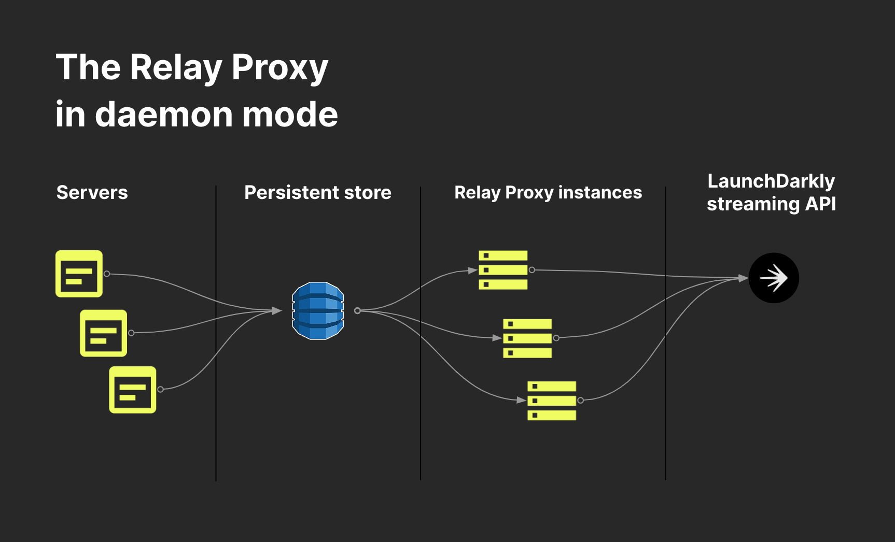

# LaunchDarkly Relay Proxy - Daemon mode

[(Back to README)](../README.md)

Optionally, you can configure our SDKs to communicate directly to a [persistent store](./persistent-storage.md). If you do this, there is no need to put a load balancer in front of the Relay Proxy.

We call this configuration **daemon mode**. This is the preferred way to use LaunchDarkly with [PHP](./php.md) (as there's no way to maintain persistent stream connections in PHP).



In this example, the persistent store is in Redis. To set up the Relay Proxy in this mode, provide a Redis host and port, and supply a Redis key prefix for each environment in your configuration:

```
# Configuration file example

[Redis]
    host = "localhost"
    port = 6379
    localTtl = 30s

[Environment "Spree Project Production"]
    prefix = "ld:spree:production"
    sdkKey = "SPREE_PROD_SDK_KEY"

[Environment "Spree Project Test"]
    prefix = "ld:spree:test"
    sdkKey = "SPREE_TEST_SDK_KEY"
```

```
# Environment variables example

USE_REDIS=1
REDIS_HOST=localhost
REDIS_PORT=6379
CACHE_TTL=30s
LD_ENV_Spree_Project_Production=SPREE_PROD_SDK_KEY
LD_PREFIX_Spree_Project_Production=ld:spree:production
LD_ENV_Spree_Project_Test=SPREE_TEST_SDK_KEY
LD_PREFIX_Spree_Project_Test=ld:spree:test
```

(The per-environment "prefix" setting can be used the same way with Consul or DynamoDB. Alternately, with DynamoDB you can use a separate table name for each environment.)

The `localTtl`/`CACHE_TTL` parameter controls the length of time that the Relay Proxy will cache data in memory so that feature flag requests do not always hit the database; see [Persistent Storage](./persistent-storage.md).

You will then need to [configure your SDK](https://docs.launchdarkly.com/sdk/concepts/feature-store#using-a-persistent-feature-store-without-connecting-to-launchdarkly) to connect to Redis directly.

Using daemon mode does not prevent you from also using [proxy mode](./proxy-mode.md) at the same time, for SDKs that cannot connect to a database (such as mobile SDKs).

## How daemon mode behaves in error conditions

Because the server-side SDKs do not make requests to the Relay Proxy in daemon mode, they have no way to know whether it is currently connected to LaunchDarkly. The behavior of the SDKs depends only on whether the database contains data.

If the Relay Proxy has not connected to LaunchDarkly successfully, but the database already contains flag data from some earlier time when this or another instance of the Relay Proxy did connect to LaunchDarkly, then the SDKs will use that data. If the Relay Proxy later succeeds in connecting to LaunchDarkly and receives current flag data, it will update the database, and the SDKs will start using the updated data as soon as any previously read data expires out of their local caches. The time to expiration is determined by the cache parameters in the SDK configuration.

If the database does not yet contain any flag data, then the standard behavior of the server-side SDKs is for all flag evaluations to return whatever value the application code specified as a fallback. If evaluation reasons are enabled, the reason will be reported as a "client not ready" error.
