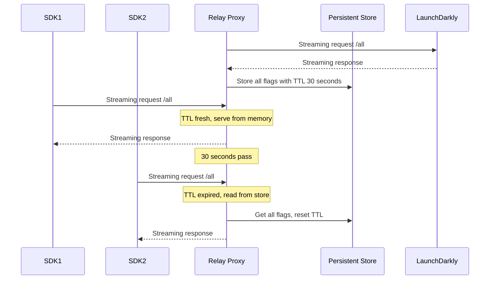
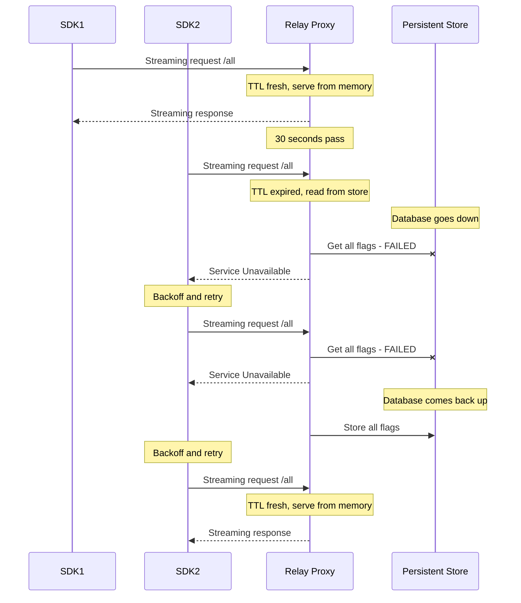
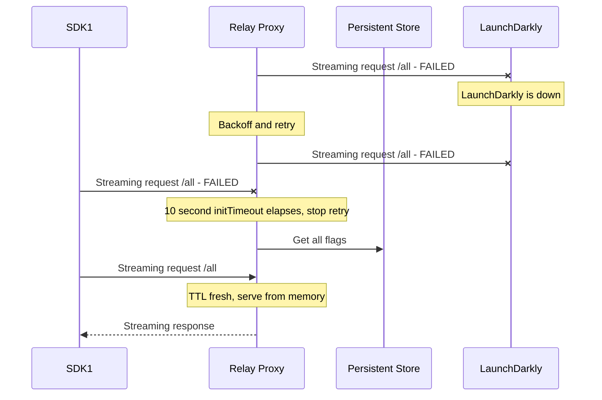

# LaunchDarkly Relay Proxy - Persistent storage

[(Back to README)](../README.md)

You can configure Relay Proxy nodes to persist feature flag settings in Redis, DynamoDB, or Consul. This provides durability in use cases like a temporary network partition that prevents the Relay Proxy from communicating with LaunchDarkly's servers. If you use Big Segments, you can only use Redis or DynamoDB as a feature store.

To learn more, read [Using a persistent feature store](https://docs.launchdarkly.com/sdk/concepts/data-stores), and the Relay Proxy documentation on [Configuration](./configuration.md).

The Relay Proxy does not support clustered Redis or Redis Sentinel.

```
# Configuration file examples

[Redis]
    host = "localhost"
    port = 6379
    localTtl = 30s

[DynamoDB]
    tableName = "my-feature-flags"
    localTtl = 30s
```

```
# Environment variables examples

USE_REDIS=1
REDIS_HOST=localhost
REDIS_PORT=6379
CACHE_TTL=30s

USE_DYNAMODB=1
DYNAMODB_TABLE=my-feature-flags
CACHE_TTL=30s
```

The Relay Proxy can only use one of these at a time. If you enable both Redis and DynamoDB it will result in an error.

LaunchDarkly SDK clients have their own options for configuring persistent storage. If you use [daemon mode](../README.md#daemon-mode), the clients need to be using the same storage configuration as the Relay Proxy. If you are not using daemon mode, the two configurations are completely independent. For example, you could have a Relay Proxy using Redis, but a client using DynamoDB or not using persistent storage at all.

If the database becomes unavailable, the Relay Proxy's behavior, based on its use of the Go SDK, depends on the `CACHE_TTL` setting:

- If the TTL is a positive number, the last known flag data will remain cached in memory for that amount of time, after which Relay will be unable to serve flags to SDK clients. After the database becomes available again, the Relay Proxy will request all of the flags from LaunchDarkly again and write the latest values to the database.
- If the TTL is a negative number, the in-memory cache never expires. Relay continues to serve flags to SDK clients and updates the cache if it receives any flag updates from LaunchDarkly. As Relay will only read from the database upon service startup, it is recommended that you avoid restarting the Relay Proxy while detecting database downtime. After the database becomes available again, the Relay Proxy will write the contents of the cache back to the database. Use the "cached forever" mode with caution, because it means that in a scenario where multiple Relay processes are sharing the database, and the current process loses connectivity to LaunchDarkly while other processes are still receiving updates and writing them to the database, the current process will have stale data.

The in-memory cache only helps SDKs using the Relay Proxy in proxy mode. SDKs configured to use daemon mode are connected to read directly from the database. To learn more, read [Configuring an SDK to use different modes](https://docs.launchdarkly.com/home/relay-proxy/using#configuring-an-sdk-to-use-different-modes).

## DynamoDB storage limitation

As described in the notes for the [LaunchDarkly Go SDK DynamoDB integration](https://github.com/launchdarkly/go-server-sdk-dynamodb/blob/master/README.md#data-size-limitation), which is the internal implementation used by the Relay Proxy, it is not possible to store more than 400KB of JSON data for any one feature flag or segment when using DynamoDB.

If the Relay Proxy receives such a large data item, it will log an error message such as this:

```
    The item "my-flag-key" in "features" was too large to store in DynamoDB and was dropped
```

Any SDKs that are using daemon mode to read directly from the database will not be able to see this flag or segment. If SDKs are connected in proxy mode, they may be able to receive the item from the Relay Proxy, but depending on caching behavior it may become unavailable later. Therefore, if you see this message, consider redesigning your flag or segment configurations, or else do not use the Relay Proxy for the environment that contains this data item.

## Example: Persistent Store with 30 second TTL

This example shows Relay configured with a persistent store with a 30 second TTL. This means Relay will serve connections
from memory if it has been less than 30 seconds since the last read from the persistent store.

In the example, **SDK1** is served immediately from memory. **SDK2** is served after a slight delay required to read 
from the persistent store first, because 30 seconds has elapsed between the first connection and the second. 



## Example: Persistent Store outage with 30 second TTL

In this example, the persistent store goes down for a period of time. 

Before the outage, **SDK1** is served immediately from memory. During the outage, **SDK2** attempts to connect 
and is denied since the TTL has elapsed since the first connection. If it had connected within the TTL, then it would
have been served from memory even if the persistent store was down.

After backing off and retrying, the persistent store is still down so **SDK2** is denied again.

The persistent store connection is then re-established and Relay writes all in-memory flag data to the store. 
**SDK2** is then able to connect and be served from memory.


## Example: Persistent Store with LaunchDarkly Outage

In this example, LaunchDarkly SaaS is down. Additionally, the Relay in this diagram is starting up **during** the 
outage.

This does not apply to Relays that are already running during a LaunchDarkly outage, as they will already be 
initialized.

The diagram demonstrates the relationship between the [`initTimeout`](./configuration.md#file-section-main) 
configuration and persistent store usage. Specifically, the Relay will be unable to serve SDK connections until
the `initTimeout` has elapsed, at which point it will serve from the persistent store.


