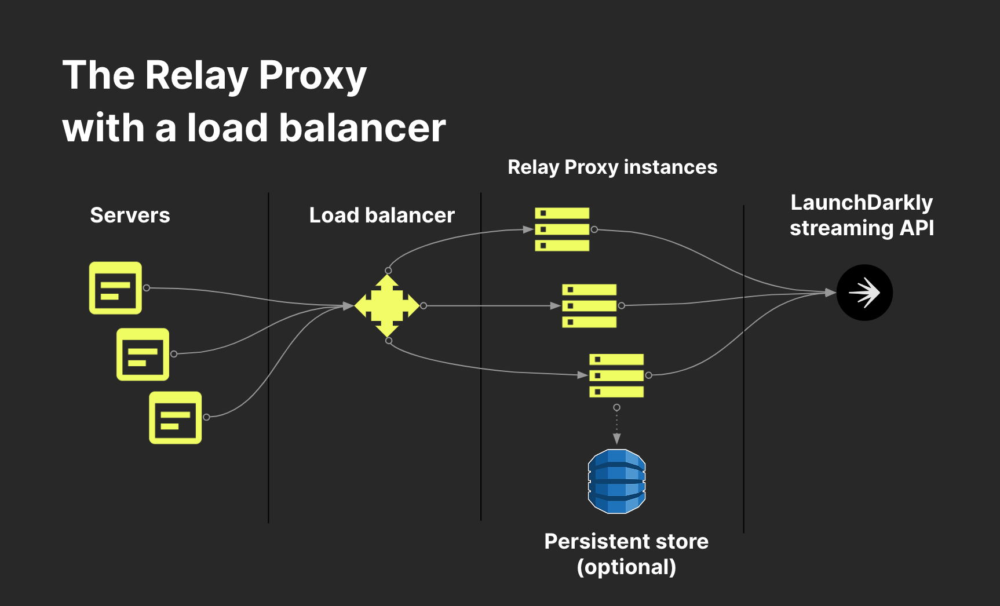

# LaunchDarkly Relay Proxy - Proxy mode

[(Back to README)](../README.md)

The Relay Proxy is typically deployed in proxy mode.

In this mode, several Relay Proxy instances deploy in a high-availability configuration behind a load balancer. Relay Proxy nodes do not need to communicate with each other, and there is no primary node or cluster. This makes it easy to scale the Relay Proxy horizontally by deploying more nodes behind the load balancer. To learn more, read [Configuring an SDK to use different modes](https://docs.launchdarkly.com/home/relay-proxy/using#configuring-an-sdk-to-use-different-modes).

You must configure your SDKs to point to the location of the Relay Proxy, so that they connect to it instead of connecting to LaunchDarkly.

To learn more, read [Configuring an SDK to use the Relay Proxy](https://docs.launchdarkly.com/home/advanced/relay-proxy/using#configuring-an-sdk-to-use-the-relay-proxy).

For a list of all of the service endpoints that Relay Proxy implements for use by the SDKs, read [Endpoints](./endpoints.md).

If you want SDKs to connect to the Relay Proxy securely, read [Using TLS](./tls.md).

## How connections are handled in error conditions

The Relay Proxy handles different error conditions in the following ways:

### Relay Proxy receives a request before it has finished connecting to LaunchDarkly

If an SDK connects to the Relay Proxy while the Relay Proxy is starting up and waiting for a connection to LaunchDarkly, the response is a `503` error. This indicates that the Relay Proxy isn't ready yet. In this case, all LaunchDarkly SDKs will retry after a backoff delay.

Eventually, the Relay Proxy stops waiting for the connection. The length of this wait depends on the [configuration option](./config.md#file-section-main) `initTimeout`. The default value is 10 seconds. 

Read the following section to learn how the Relay Proxy handles a time out.

### Relay Proxy receives a request after the LaunchDarkly connection attempt has timed out

By default, if the initialization timeout elapses and the Relay Proxy has not yet received flag data from LaunchDarkly, it will give up and shut down completely. However, if the [configuration option](./configuration.md#file-section-main) `ignoreConnectionErrors` is set to `true`, it will stay running and keep trying to connect to LaunchDarkly.

If the Relay Proxy receives requests from SDKs by this time, the behavior depends on whether there is any source of last known flag data:

* If you configure the Relay Proxy to use [persistent storage](./persistent-storage.md) and there is already flag data in the database from a previous time, then it will provide that data to SDKs. Later, if it receives current flag data from LaunchDarkly, it will provide the current data to all currently connected SDKs as well as to all subsequent requests.

* If the Relay Proxy does not use persistent storage, or if the database was never populated, then it will respond to all _polling_ requests from SDKs with a `503` error. This indicates that the SDKs should try again later because there is no data yet. The Relay Proxy accepts all _streaming_ requests from SDKs, but they will not receive any data until the Relay Proxy has received flag data from LaunchDarkly.

### Relay Proxy receives a request while starting up in automatic configuration mode

If you're an Enterprise customer using [automatic configuration](https://docs.launchdarkly.com/home/advanced/relay-proxy-enterprise/automatic-configuration), the first thing the Relay Proxy does on startup is request the configuration data from LaunchDarkly. During this time, the Relay Proxy does not yet know what the configured environments are, so it has no way to know if an SDK key or other credential in a request is valid. Therefore it returns a `503` error for all requests, indicating that it isn't ready yet. In this case, all LaunchDarkly SDKs will retry after a backoff delay.

### Relay Proxy receives a request with invalid credentials

If a server-side or mobile SDK connects to the Relay Proxy with an invalid SDK key or mobile key, the response is a `401` error.

If a client-side SDK such as the JavaScript SDK connects to the Relay Proxy with an invalid client-side environment ID, the response is a `404` error. This slightly different error behavior corresponds to how the LaunchDarkly service endpoints for those SDKs work. In this case, all LaunchDarkly SDKs will give up with no retries.
