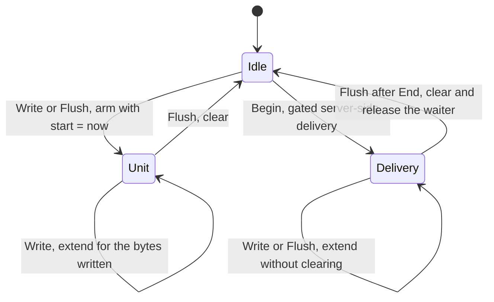

# Relay v9: a write deadline for every SDK write

Ticket: SDK-3225. Branch: `mk/sdk-3225/stream-write-deadline` (off `v9` at `bd063f29`).

This replaces the eventsource-side approach (launchdarkly/eventsource#80) with a relay-side
one. It builds on Ryan's `internal/initwrite` instead of replacing it. The only eventsource
change it needs is `%v` -> `%w` in the Encoder (a separate PR), and even that is optional.

## Problem

A client that stops reading parks a relay stream handler in a socket write. Corbin's incident
was a proxy that half-closes the upstream connection. One process had 22 handlers parked for
17 to 47 minutes, each pinning about 50 MB. `MAX_CLIENT_CONNECTION_TIME` cannot end such a
handler, because eventsource checks it only between writes.

## What v9 has today

`initwrite.Writer` sets a progress-aware write deadline. It has two shapes:

- **Poll** (`Wrap`): the deadline is armed on every write for the whole response. The poll
  middleware uses it (`internal/middleware/concurrency.go`).
- **Gated stream** (`WrapGated`): the deadline is armed only between the producer's `Begin` and
  the end-of-delivery flush after `End`. Only the server-side stream uses it, and only for the
  initial delivery (`withInitDeadline` in `internal/streams/stream_provider_server_side.go`).

Each write gets `now + chunk/64KiB + 5s`, re-armed per 1 MiB chunk, capped at
`msgStart + maxHold` (`INIT_SEND_TIMEOUT`). `Cut` moves the deadline to now when the request
context ends. `WaitAndFinish` holds the limiter slot until the delivery flushes.

Two gaps matter here:

1. **Everything is gated on the limiter.** `withInitDeadline`, `LimitConcurrency`, and
   `ProvideInitLimiter` all pass through when `INIT_MAX_CONCURRENT` is unset, which is the
   default. With the default config, no relay write has a deadline.
2. **Only the initial delivery is covered.** Deltas and heartbeats on a live stream, and all
   writes on the flags-only, mobile-ping, and JS-ping streams, have no deadline even with the
   limiter on.

## Proposal

### A stream shape for initwrite

Add a third shape, `WrapStream`, that covers every write on a persistent SSE connection. It
infers units of output from the calls that eventsource already makes:

- A **unit starts** at the first `Write`, `WriteString`, or `Flush` after an idle period.
- A **unit ends** at the next `Flush`, which clears the deadline.

Eventsource flushes after the headers, after each live event or comment, and once at the end of
each replay batch. So a live event is one unit and a whole replay batch is one unit. An idle
stream never carries a deadline, which is what HTTP/2 needs.

The deadline is **cumulative from the unit's start**:
`start + written/minBytesPerSecond + slack`, capped at `start + maxWriteTime`. `written` counts
the bytes passed to the connection. Relay serves without gzip today, but the writer sits below
eventsource's gzip either way. This fixes a weakness in the current per-chunk formula: a client
that reads below the floor in small steps keeps re-arming `now + small/rate + slack` and
survives until the cap. With the cumulative formula, it falls behind the deadline as soon as its
average rate drops below the floor. The deadline is moved only when it grows by at least
100ms, so a large unit does not set it on every write.

A gated delivery uses the same engine. `Begin` starts a unit that spans flushes until `End`,
and its cap is `INIT_SEND_TIMEOUT`. `Cut`, `CapEngaged`, `DeadlineSetErrors`, `Done`, and
`WaitAndFinish` keep their current contracts.

### One wrapper for all four stream kinds

A new handler wrapper, `withWriteDeadline`, wraps every SSE handler in `WrapStream` when the
write-deadline config is set, whether or not the limiter is enabled. It covers the server-side,
flags-only, mobile-ping, and JS-ping streams. It also does three more things:

- It runs the `Cut` watcher, so a client that goes away mid-write is cut at once. That includes
  Corbin's half-close, because net/http cancels the request context when it reads the FIN.
- In its defer (still inside the handler), on HTTP/1 only, it arms a slack-only deadline. That
  bounds the final flush that net/http does after the handler returns. net/http clears the
  deadline after that flush. HTTP/2 is skipped, because a leftover deadline there can reset a
  stream the client has already closed.
- The server-side stream keeps `withInitDeadline`'s gating on top, using the same `Writer`.

### Configuration

New `[Main]` options, all unset by default. The feature is opt-in only: there is no default
floor.

| Option | Env var | Meaning |
| --- | --- | --- |
| `clientWriteMinBytesPerSecond` | `CLIENT_WRITE_MIN_BYTES_PER_SECOND` | Throughput floor. Setting it enables the feature. |
| `clientWriteSlack` | `CLIENT_WRITE_SLACK` | Fixed allowance per unit. Default 5s when the floor is set. |
| `clientWriteMaxTime` | `CLIENT_WRITE_MAX_TIME` | Cap per unit. Optional; must be at least the slack. |

When TLS is enabled and the feature is on, relay also sets
`http.Server.HTTP2.WriteByteTimeout` to the slack. Without it, a client that stops reading a
whole HTTP/2 connection can keep the stream reset from ever being sent. This comes from
Corbin's #882.

When the limiter is enabled, gated deliveries keep their 64 KiB/s floor and 5s slack. If the
new floor is also set, they use the larger of the two floors.

The two settings are independent:

| Write-deadline config | Limiter | Streams get |
| --- | --- | --- |
| unset | off | Nothing. This is today's default. |
| unset | on | Today's gated initial delivery only, with cumulative accounting. |
| set | off | A deadline on every write, on all four stream kinds. |
| set | on | Every write, plus the gated delivery's slot handling and `INIT_SEND_TIMEOUT` cap. |

Polls follow the same table: see Polling.

### Polling

Polls follow the same rule as streams. When the write-deadline config is set, every SDK response
that carries flag data gets a deadline, whether or not the limiter is on. A poll response is one
unit, from its first write until the handler returns, so it uses the same cumulative formula,
capped at `clientWriteMaxTime`. When the limiter is on, a limited poll keeps its slot handling
and its `INIT_SEND_TIMEOUT` cap, as a gated stream delivery does.

The covered responses (from `relay/relay_routes.go`):

- the server-side polls: `/sdk/latest-all` (`/flags`), `/sdk/poll`, `/flags/{key}`, and
  `/segments/{key}`;
- the server-side, JS, and mobile `evalx` endpoints;
- the client-side FDv2 poll;
- the JS goals endpoint.

Event intake and `/status` are not covered. Their responses are a few bytes, so a client that
stops reading cannot hold much.

## What does not change

- Eventsource stays as it is on `main`. #80 stays open until we decide.
- The limiter, `WaitAndFinish`, and the slot accounting.
- The `sseLogger` warning for a deadline cut. Once the eventsource `%w` change ships, its
  text-matching fallback in `isDeadlineExceeded` can go.

## Risks

- **Implicit coupling to eventsource's flush pattern.** Unit detection depends on eventsource
  flushing after each live event and once per replay batch. That is true today, but it is not a
  documented contract. Relay tests pin it against the vendored eventsource version.
- **Producer time inside a replay batch counts against the client.** This already happens for
  gated deliveries today. FDv2 serializes the whole basis before sending, so the gap is small.

## Tests

- Unit tests for the stream shape: arming and clearing per unit, cumulative accounting, the
  100ms granularity, `Cut` while idle and mid-unit, the exit deadline on HTTP/1 only, and a
  gated delivery that spans flushes.
- A test with a steady client below the floor, using a fake ResponseWriter that enforces its
  deadline, which fails under per-chunk accounting.
- Real-socket stall tests over HTTP/1 and HTTP/2: the initial `put`, a live delta after the
  initial delivery, and each of the four stream kinds.
- An idle stream that survives gaps longer than the slack, on both protocols.
- With the limiter enabled: a gated delivery that hits `INIT_SEND_TIMEOUT`, and a delivery
  followed by a live-stream stall, so the two shapes are shown to compose.
- Config validation, plus the defaults when only the floor is set.

## Decisions

- **Opt-in only (2026-10-01).** No default floor. With the config unset, streams are wrapped
  only as the limiter wraps them today.
- **Cumulative accounting for gated deliveries (2026-10-01).** Gated deliveries also switch to
  `msgStart + written/rate + slack`, capped at `INIT_SEND_TIMEOUT`. The poll shape switches too.
- **Polls are handled consistently with streams (2026-10-01).** See Polling.
- **Config names accepted (2026-10-01).**
- **Chunked arming stays (found during implementation).** Arming once for a whole large write
  would give a client that stalls at its first byte the whole write's budget: about 13 minutes
  for 50 MB at 64 KiB/s. Arming before each 1 MiB chunk, with the bytes counted cumulatively,
  cuts it after one chunk's budget, about 21 seconds.

